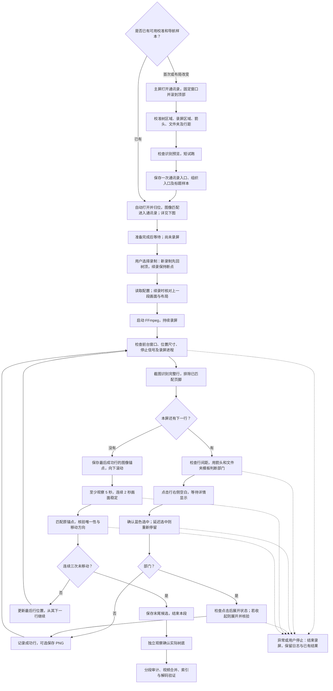
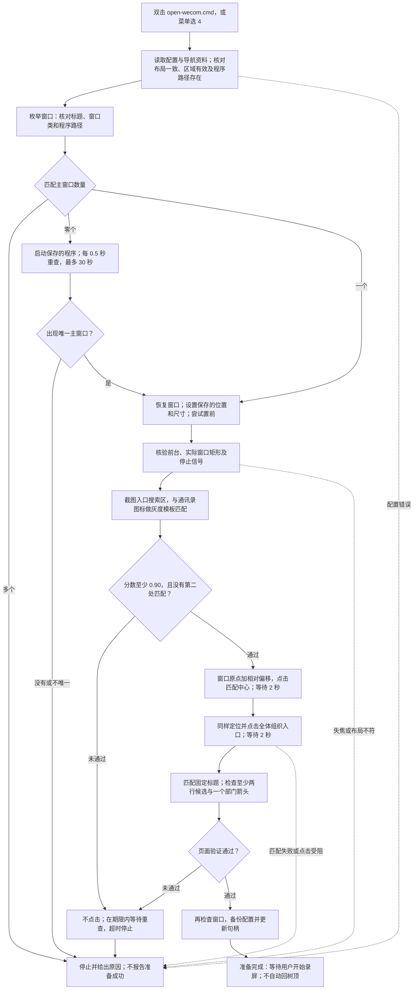
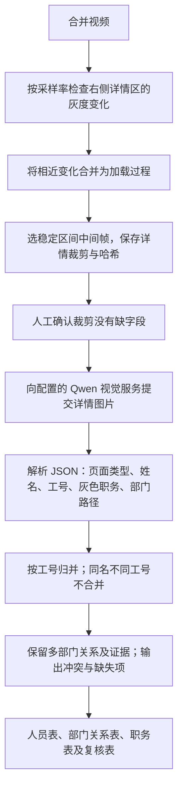

# 算法流程与窗口适配

录屏程序使用 OpenCV 图像匹配、Windows 鼠标输入和 FFmpeg，不调用大模型，也不在遍历过程中运行 OCR。新增的后处理模块 `video_extraction/` 会调用视觉模型提取个人详情，完整用法见 [中文首页](README.md)。以下先说明录屏与自动打开，再说明后处理。

整体分成两步：**自动准备窗口与页面 → 用户选择开始录屏 → 逐行浏览并保存**。首次保存的校准数据会重复使用；自动准备成功只代表找到了符合规则的通讯录画面，不代表已回到树顶或已经开始采集。

正常达到节点或时间上限也会结束本段；分段脚本对符合条件的段审计后续录。箭头无法辨认、选中失败、锚点丢失或不唯一时不会盲目继续。Windows Ghost 无响应窗口出现时可无输入等待最多 30 秒，原目标窗口恢复前台才继续。

核心是“展开部门后按可见行自上而下走”，自然进入其子部门和人员。翻屏时重新找到上一屏最后成功行，从下一行继续；不会按名字去重。蓝色选中只能证明选中了行，右侧详情是否加载完整依靠停留时间和试跑抽查，不是模型自动判断。

## 不同窗口尺寸、位置能否使用？

**现在可用 `launch.cmd` 选项 4 自动恢复已校准的固定位置和尺寸。程序不会在任意尺寸下动态适配，也不会在录制中跟随窗口。**

| 情况 | 当前行为 / 使用要求 |
|---|---|
| 开始前换位置或尺寸 | 选项 4 自动恢复原布局；若希望采用新的布局，则重新校准并设置导航样本 |
| 运行中拖动、缩放或最大化 | 窗口矩形与校准值不一致，程序停止 |
| 只改变树栏宽度或应用内部布局 | 外窗矩形可能不变，窗口保护未必发现；应主动停止并重新校准 |
| 改 DPI、显示缩放、主题或字体 | 图标像素和行距可能改变，需要重新校准与验证；当前只适配浅色主题 |
| 移到其他显示器 | 当前校准按主屏设计，未验证多屏，使用主屏 |
| 最小化、切到别的软件或遮挡 | 需要前台可见；失焦或点击位置被遮挡时停止，录屏仍可能捕捉覆盖物 |
| 重启企业微信 | 选项 4 重新查找主窗口，验证导航后更新句柄；旧录像续录仍要求原句柄和布局一致，不自动放宽 |
| 中断后续录 | 树区、录屏区、窗口句柄、窗口矩形和行距必须与上一段一致，并通过画面核验 |

原因：`config.json` 保存屏幕绝对坐标和窗口矩形；点击使用这些坐标，FFmpeg 也按固定屏幕矩形录制。每次输入前检查窗口矩形是否变化。图像识别本身不要求固定窗口宽高，但需要完整可见的行、可辨认的图标、行右侧可点击空白及清晰完整的详情。

新增的 `startup.py` 用窗口相对区域匹配导航入口，但录屏仍采用原固定屏幕区域。自动适应任意尺寸还需要重新定位树与详情、处理布局和 DPI 变化，当前未实现。

## 自动打开的原理与详细流程

程序先让窗口回到已验证的布局，再用小图片寻找入口。操作系统负责找窗口和移动窗口，OpenCV 负责判断图标在什么位置，Windows 鼠标输入负责点击。

| 步骤 | 实际实现 | 为什么这样做 |
|---|---|---|
| 保存一次样本 | `startup.py setup` 保存程序路径、校准布局、入口小图及窗口内搜索区域 | 后续直接复用，不需要每次手工框选 |
| 找到正确窗口 | `EnumWindows` 枚举窗口，同时检查标题、窗口类和可执行文件路径 | 区分企业微信主窗口、预览窗口及其他程序；多个主窗口时停止 |
| 必要时启动 | 未找到主窗口才用 `subprocess.Popen` 启动已保存的程序路径，每 0.5 秒重新查找，最多 30 秒 | 等待程序打开；不代替用户完成登录 |
| 恢复固定布局 | `ShowWindow` 恢复窗口，`SetWindowPos` 设置原来的位置和尺寸，`SetForegroundWindow` 尝试置前，再核验实际状态 | 让树区域、图标大小和录屏范围回到原校准条件；失败就停止 |
| 找到入口 | 把搜索区域截图和模板转为灰度，用 OpenCV `TM_CCOEFF_NORMED` 计算归一化相关系数并取绝对值 | 使用图像外观匹配，不理解文字含义；取绝对值可容忍部分明暗反转 |
| 决定是否点击 | 最高匹配分数至少 0.90；排除同一个目标附近的重叠匹配后，不能再有另一个达到 0.90 的位置 | 匹配不足或目标有歧义时不点击；该分数不是“90% 正确概率” |
| 计算点击位置 | 窗口左上角 + 搜索区相对偏移 + 匹配图片中心 | 在已验证区域内找到目标后点击，不把入口坐标写死 |
| 验证结果 | 依次点击通讯录、全体入口，检查固定标题、至少两行候选节点及至少一个部门箭头 | 点击完成后还要确认出现了符合规则的组织树；不证明所有部门或人员完整 |
| 保存准备结果 | 再次检查窗口；备份原配置后，用临时文件替换配置，仅更新当前窗口句柄 | 导航失败不写回新句柄；成功后等待用户开始录屏 |

入口定位和最终页面验证各有 15 秒重试期限；现有 Ghost 无响应等待和 F8 暂停会影响实际总耗时，因此不能将其理解为整个启动操作最多 15 秒。等待阶段支持原有停止保护，不通过反复盲点推进。

这套方法计算量低，是因为只在较小区域做图片匹配，没有模型推理。它能恢复已知窗口布局，但不会自动理解任意主题、DPI、面板宽度或新版本布局；这些变化仍可能需要重新校准。

代码对应：`startup.py` 的 `setup`、`Desktop.find`、`Desktop.restore`、`match_entry`、`navigate`、`prepare`；`app.py` 的 `calibrate`、`run`、`settled_tree`；`vision.py` 的 `rows`、`arrow`、`locate_anchor`；`win_input.py` 的 `checkpoint`；`recorder.py` 的 `Recorder`。

## 视频到人员和部门关系

稳定帧选择和归并使用本地规则，详情识别使用 `Qwen3.6-35B-A3B`。默认每秒检查 4 帧、变化阈值 0.2、相邻变化合并间隔 1 秒、最短稳定区间 0.75 秒。这些是图像处理参数，不是识别准确率。默认 ROI 适配指定录屏布局；模型无法恢复画面里未出现或被裁掉的字段。人员表可能包含标为 `needs_review` 的冲突记录，需要与复核表一起检查。
