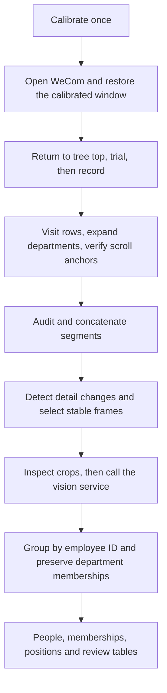

# WeCom Directory: Screen Recording and Video Extraction

[中文首页](README.md) · [Recorder guide (Chinese)](RECORDER_GUIDE.md) · [Algorithm diagrams](ALGORITHM.md)

Browse the organization tree visible to your WeCom account, record contact details, and extract employee IDs, names, visible job titles, and department paths into CSV tables.

This repository combines a Windows recorder with a video-to-personnel extraction pipeline. It contains source code, documentation, and synthetic tests only. Recordings, screenshots, employee data, credentials, and machine-specific calibration are excluded.

## Model dependencies

| Stage | Implementation | Model required? |
|---|---|---|
| Window discovery, positioning, navigation | Windows APIs and OpenCV templates | No |
| Screen recording and concatenation | FFmpeg, 4 FPS by default | No |
| Change detection and stable-frame selection | OpenCV | No |
| Reading structured contact details | Image-capable OpenAI-compatible endpoint | Yes: currently fixed to `Qwen3.6-35B-A3B` |
| Identity grouping and CSV export | Python rules | No |

The recorder is model-free; the complete combined pipeline is not. Selected detail images are sent to the service you configure. Use a service authorized to handle your data. Inference runs server-side, so the client does not require a GPU. Legacy PaddleOCR-VL subtitle/OCR workflows are also included but are not required by the desktop-detail command.



## Install

Recording requires Windows, Python 3.13, WeCom, and FFmpeg/ffprobe on PATH. The tested UI uses the primary monitor and a light theme. Video extraction can run separately; other operating systems were not validated in this integration.

```powershell
git clone https://github.com/AetherX-Technologies/wecom-directory-recorder.git
cd wecom-directory-recorder
$env:PYTHONUTF8 = "1"
powershell -ExecutionPolicy Bypass -File .\setup.ps1
# Optional: install the extraction package in the same environment.
.\.venv\Scripts\python.exe -m pip install -e .\video_extraction
```

The setup script installs recording dependencies only. The extraction package uses a fixed-version `pyproject.toml`; installation makes no model requests.

## 1. Calibrate and open WeCom

To check the extraction environment first, run a synthetic offline demo. The output directory must not already exist:

```powershell
.\.venv\Scripts\python.exe video_extraction/examples/offline_demo.py --output-dir outputs/offline-demo
```

It generates a test video and uses a fixed fake client to verify selection, parsing, and export: one synthetic employee and two memberships. It makes no model calls and does not measure recognition accuracy.

Open the directory on your primary display and scroll to the top. Keep both an expanded and a collapsed department visible. Run `launch.cmd`:

- **1**: select the tree, recording area, collapsed arrow, expanded arrow and folder icon; inspect the detection preview.
- **5**: save navigation templates once: Contacts icon, organization entry, and fixed page heading.
- **4**, or `open-wecom.cmd`: locate/launch WeCom, restore its saved position and size, navigate to Contacts → All, and validate the tree.

Automatic preparation does not log in, record, reset scrolling, or navigate to arbitrary departments. Moving or resizing before preparation is supported by restoring the old layout. Changes during recording stop input. Changes to DPI, theme or internal pane layout require recalibration. Local calibration is not shipped in the repository.

## 2. Record and assemble

Choose **2** for a 10-row trial with screenshots. Check selection, expansion, and legible details. Return to the tree top before starting a new full recording:

```powershell
.\.venv\Scripts\python.exe app.py run --dwell 5 --snapshots
```

F8 pauses/resumes. Esc, moving the pointer to the upper-left corner, or creating a root `STOP` file stops recording. Recording occupies the desktop. Default limits are 10,000 rows and 180 minutes; adjust `config.json` as needed. Reaching a limit means partial completion.

Replace the example run IDs with actual directory names:

```powershell
.\.venv\Scripts\python.exe audit_run.py .\runs\RUN_ID
.\.venv\Scripts\python.exe app.py run --resume .\runs\RUN_ID --snapshots
# Alternatively, audited normal segments can be continued by the batch runner:
.\.venv\Scripts\python.exe batch_run.py --after .\runs\RUN_ID
.\.venv\Scripts\python.exe assemble.py .\runs\LAST_RUN_ID
```

Resume requires matching window geometry and the prior visual checkpoint. Assembly writes `delivery/<timestamp>/capture-all.mkv`, `frames.jsonl`, and `manifest.json`. Three unchanged scrolls produce an end candidate, requiring independent visual confirmation. Visited rows include departments and repeated appearances, not unique employees.

## 3. Select frames locally

Run from the repository root. Replace `YOUR_DELIVERY` and use a separate output directory for each video:

```powershell
.\.venv\Scripts\python.exe -m rapid_videocr.wechat_detail_extractor `
  --video ".\delivery\YOUR_DELIVERY\capture-all.mkv" `
  --output-dir ".\outputs\demo" `
  --selection-only
```

This makes no model requests. Inspect `outputs/demo/frames/` before analysis. The crop assumes the tested **984×794 tree-and-detail recording layout**, using x=41.5%–87.5% and y=7.5%–91% of each frame. Proportional cropping does not support arbitrary layouts. Adapt `compose_wechat_detail_roi()` if necessary, then select again into a fresh output directory. The default 4 samples/second examines every frame of a 4 FPS recording, but samples higher-frame-rate recordings.

## 4. Configure the vision service and run a small trial

```powershell
Copy-Item .\video_extraction\.env.example .\.env
```

Edit the root `.env` with your authorized full completion URL and credentials:

```dotenv
VL_MODEL_URL=https://vision.example.com/v1/chat/completions
VL_MODEL_NAME=Qwen3.6-35B-A3B
VL_MODEL_KEY=replace-with-your-api-key
VL_MODEL_TIMEOUT=180
VL_MODEL_MAX_RETRIES=2
```

The inherited client enforces this model name and its existing service restrictions; it does not silently switch providers or models.

```powershell
.\.venv\Scripts\python.exe -m rapid_videocr.wechat_detail_extractor `
  --video ".\delivery\YOUR_DELIVERY\capture-all.mkv" `
  --output-dir ".\outputs\demo" `
  --reuse-selection --workers 1 --batch-size 1 --limit 10
```

`--limit` limits analysis, not the initial full video scan. Inspect results, remove `--limit 10`, and increase concurrency only within your service capacity, for example `--workers 4 --batch-size 4`. Completed results are reused. Use a new output directory after changing the video, crop, model, or prompt. A successful process exit alone does not prove that all frames were analyzed; check the summary and unresolved-frame list.

## 5. Outputs and review

| File | Meaning |
|---|---|
| `wechat_people.csv` | One row per valid employee ID; conflicts may remain with `review_status=needs_review` |
| `wechat_memberships.csv` | One row per employee and department path; preserves multiple memberships |
| `wechat_positions_all.csv` | Observations with a visible title, including unidentified records needing review; not the complete directory |
| `wechat_people_with_positions.csv` | People-table subset with titles |
| `wechat_review.csv` | Missing/invalid IDs, name/title conflicts, and missing departments |
| `wechat_detail_observations.csv` | Per-frame records with evidence locations |
| `wechat_summary.json` | Analysis, failure, unresolved counts and limited-run flag |
| `unresolved_model_frames.jsonl`, `model_failures.jsonl` | Unresolved frames and historical failures |
| `raw_model.jsonl`, `frames/` | Raw model responses and selected-frame evidence |

Treat employee IDs as strings to preserve leading zeros. Equal names with different IDs remain separate people. Department paths represent observed memberships; they do not prove complete backend organization coverage or reveal empty departments. Hidden fields are not expanded.

Reviewed corrections may be supplied using `--overrides .\local-only\review.csv` with columns `user_code,name,position,resolution_note,evidence`. This is a name/title correction mechanism, not an arbitrary membership replacement interface. Always check supporting evidence.

## Development and provenance

```powershell
.\.venv\Scripts\python.exe -m pip install -r requirements-dev.txt
.\.venv\Scripts\python.exe -m unittest discover -s . -p "test_*.py"
.\.venv\Scripts\python.exe -m pytest video_extraction/tests -q
```

Extraction tests block network access and use synthetic inputs/fake clients. Test success is not a model-accuracy claim. See [PUBLIC_RELEASE.md](PUBLIC_RELEASE.md) for integration validation.

The extraction package derives from [RapidVideOCR](https://github.com/SWHL/RapidVideOCR), retaining its Apache-2.0 license and attribution. See [THIRD_PARTY_NOTICES.md](THIRD_PARTY_NOTICES.md). Private name/department correction defaults and personal watermark patterns were removed from this public copy; the original local project remains unchanged.

This is not an official WeCom API or a universal exporter. Use only information you are authorized to process, and review extracted identities and relationships. No model weights or real directory datasets are distributed.
