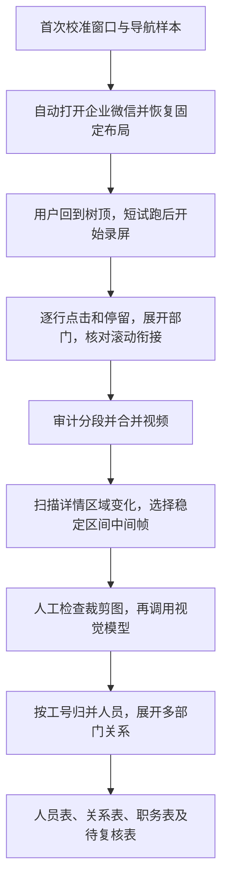

# 企业微信通讯录：自动录屏与视频信息提取

[English](README.en.md) · [录屏详细指南](RECORDER_GUIDE.md) · [算法流程图](ALGORITHM.md) · [解析模块](video_extraction/README.md)

将当前账号可见的企业微信组织树逐行浏览、录成视频，再从稳定的个人详情画面提取姓名、工号、职务和部门路径，导出人员表及人员—部门关系表。

本仓库整合两套程序：**Windows 桌面浏览录屏**与**视频人员信息提取**。公开版本只包含代码、文档和虚构测试数据，不包含通讯录、视频、截图、API Key 或本机校准配置。

## 哪些步骤使用模型？

| 阶段 | 技术 | 模型依赖 |
|---|---|---|
| 打开企业微信、窗口归位、点击组织树 | Windows API + OpenCV 模板匹配 | 无 |
| 录制、合并视频 | FFmpeg，默认 4 FPS | 无 |
| 扫描视频变化、选取稳定画面 | OpenCV | 无 |
| 读取个人详情中的姓名、职务、工号、部门 | OpenAI 兼容的图像接口 | 当前代码固定使用 `Qwen3.6-35B-A3B` |
| 按工号归并、保留多部门关系、生成 CSV | Python 规则 | 无 |

原来的“无需大模型”指录屏程序。**合并后的完整流程包含视觉模型调用**：所选详情图片会发送至你配置的服务地址，请只使用获准处理该数据的服务。模型推理由服务端完成；本机无需 GPU。另保留 PaddleOCR-VL OCR/字幕工具，它不是桌面详情抽取命令的必经步骤。

## 完整流程



## 安装

录屏需要 Windows、Python 3.13、企业微信桌面客户端，以及已加入 PATH 的 FFmpeg/ffprobe。已验证的界面为主屏浅色主题。视频解析可独立运行，但其他系统未作本次实机验证。

```powershell
git clone https://github.com/AetherX-Technologies/wecom-directory-recorder.git
cd wecom-directory-recorder
$env:PYTHONUTF8 = "1"
powershell -ExecutionPolicy Bypass -File .\setup.ps1
# 如需视频信息提取，再安装解析模块到同一个虚拟环境：
.\.venv\Scripts\python.exe -m pip install -e .\video_extraction
```

`setup.ps1` 只安装录屏依赖；上面的第二条安装命令不调用模型。不要安装来源目录中旧版的动态发布脚本，本仓库使用固定版本的 `pyproject.toml`。

## 1. 校准与自动打开

想先验证解析环境，可运行完全离线的虚构样例（输出目录须尚不存在）：

```powershell
.\.venv\Scripts\python.exe video_extraction/examples/offline_demo.py --output-dir outputs/offline-demo
```

它生成一段测试视频，用固定模型替身验证选帧、解析和导出，预期得到 1 名虚构人员及 2 条部门关系，不代表真实模型识别准确率。

1. 打开企业微信通讯录，固定窗口，树滚到最顶部，同时保留一个展开部门和一个收起部门。
2. 双击 `launch.cmd`，选 **1**，框选树区、录屏区、两种箭头及文件夹，检查生成的识别预览。
3. 选 **5**，保存一次通讯录入口小图标、全体/组织入口和固定标题样本。
4. 此后双击 `open-wecom.cmd`，或菜单选 **4**，自动找窗口、恢复校准时位置尺寸并进入通讯录。

自动打开不自动登录、不开始录屏、不保证回到树顶，也不定位任意指定部门。窗口可以在启动前被移动或缩放，程序会恢复旧布局；录制期间移动或缩放会触发停止。更换 DPI、主题或内部面板布局时须重新校准。配置和图标仅保存在本机，克隆仓库后需要自己设置。

## 2. 试跑、录制与合并

树回到顶部后，菜单选 **2** 试跑 10 行并保存 PNG。确认部门展开、选中状态和右侧文字都正确后，新录制再次回到顶部：

```powershell
.\.venv\Scripts\python.exe app.py run --dwell 5 --snapshots
```

F8 暂停/继续，Esc 或鼠标移到屏幕左上角停止，也可在程序目录创建 `STOP` 文件。正常录制占用当前桌面。默认上限为 10,000 行、180 分钟，可在 `config.json` 调整；达到上限表示部分完成。

每段位于 `runs/<运行目录>/`，包含视频、日志、摘要及可选逐行截图。将下面的 `RUN_ID` 替换为实际目录名：

```powershell
.\.venv\Scripts\python.exe audit_run.py .\runs\RUN_ID
# 保持上一段的窗口、布局及末尾画面，显式续录：
.\.venv\Scripts\python.exe app.py run --resume .\runs\RUN_ID --snapshots
# 或由分段脚本在审计合格的正常分段之后接续：
.\.venv\Scripts\python.exe batch_run.py --after .\runs\RUN_ID
# 完成后传入链中最后一段：
.\.venv\Scripts\python.exe assemble.py .\runs\LAST_RUN_ID
```

合并产物在 `delivery/<时间>/`：`capture-all.mkv`、`frames.jsonl` 和 `manifest.json`。三次滚动未移动只报告末尾候选，需要观察真实树底；日志行数含部门和重复人员，不是独立人数。详细恢复与审计规则见[录屏指南](RECORDER_GUIDE.md)。

## 3. 先离线选帧，检查裁剪范围

以下命令从仓库根目录执行。将 `YOUR_DELIVERY` 换成实际交付目录，并为每个视频使用独立输出目录。

```powershell
.\.venv\Scripts\python.exe -m rapid_videocr.wechat_detail_extractor `
  --video ".\delivery\YOUR_DELIVERY\capture-all.mkv" `
  --output-dir ".\outputs\demo" `
  --selection-only
```

这一步不调用模型。打开 `outputs/demo/frames/` 检查选帧是否清晰、完整包含姓名下方职务、工号及全部部门路径。

**当前裁剪适配 984×794 的“左侧树 + 右侧详情”录像布局**：横向取 41.5%–87.5%，纵向取 7.5%–91%。比例缩放不等于适配任意画面；若录屏范围或详情布局不同，需要调整 `compose_wechat_detail_roi()`，更换输出目录并重新选帧。默认每秒检查 4 帧，4 FPS 视频会检查每一帧；较高帧率视频按采样率检查变化。

## 4. 配置视觉服务，再做小批量识别

```powershell
Copy-Item .\video_extraction\.env.example .\.env
```

编辑根目录 `.env`，填写获准使用的完整接口地址、模型名和密钥：

```dotenv
VL_MODEL_URL=https://vision.example.com/v1/chat/completions
VL_MODEL_NAME=Qwen3.6-35B-A3B
VL_MODEL_KEY=replace-with-your-api-key
VL_MODEL_TIMEOUT=180
VL_MODEL_MAX_RETRIES=2
```

当前客户端严格校验模型名，并保留原项目的服务限制，不自动切换到其他模型。先处理少量选帧：

```powershell
.\.venv\Scripts\python.exe -m rapid_videocr.wechat_detail_extractor `
  --video ".\delivery\YOUR_DELIVERY\capture-all.mkv" `
  --output-dir ".\outputs\demo" `
  --reuse-selection --workers 1 --batch-size 1 --limit 10
```

`--limit` 只限制本次分析范围，不限制前面的完整视频扫描。检查结果后去掉 `--limit 10`，按服务容量设置并发，例如 `--workers 4 --batch-size 4`。同一输出目录会按已保存结果恢复分析；**不要在更换视频、裁剪规则、模型或提示词后沿用旧输出目录**。程序不会根据退出码自动保证所有帧成功，须检查摘要和失败清单。

## 5. 看哪些结果？

| 文件 | 用途 |
|---|---|
| `wechat_people.csv` | 工号归并后的一人一行；检查 `review_status`，冲突记录也可能在表内 |
| `wechat_memberships.csv` | 一人一部门一行，保留多部门路径，可据路径重建观察到的组织层级 |
| `wechat_positions_all.csv` | 有可见职务的记录，包括缺工号但有职务的待核对项；不是完整员工名册 |
| `wechat_people_with_positions.csv` | 人员表中有职务的子集 |
| `wechat_review.csv` | 缺工号、工号无效、姓名/职务冲突或缺部门等复核项 |
| `wechat_detail_observations.csv` | 每个画面的抽取记录及证据位置 |
| `wechat_summary.json` | 已分析数、失败数、未解决帧数、是否限量运行 |
| `unresolved_model_frames.jsonl` / `model_failures.jsonl` | 未完成帧和历次失败记录 |
| `raw_model.jsonl` / `frames/` | 模型返回与选帧证据，用于回查 |

工号按字符串保存，避免 Excel 吞掉前导零。同名不同工号不会合并；同一工号多部门保留多条关系。只有显示在画面中的信息可提取，隐藏电话等不展开。部门路径只能重建可观察层级，不能证明后台全部组织或无人部门都覆盖。

人工核对后可提供 CSV，列为 `user_code,name,position,resolution_note,evidence`，通过 `--overrides .\local-only\review.csv` 应用姓名/职务修正。它不能替代原始证据核对，也不是任意部门关系替换接口。

## 目录与开发验证

```text
app.py / vision.py / win_input.py   桌面遍历与停止保护
startup.py / open-wecom.cmd         自动打开与窗口归位
recorder.py / assemble.py           录屏、分段审计与合并
video_extraction/rapid_videocr/     详情抽取、旧版 OCR、人员归并
video_extraction/tests/             虚构样例与离线模型替身测试
RECORDER_GUIDE.md / ALGORITHM.md    录屏用法与流程图
```

```powershell
.\.venv\Scripts\python.exe -m pip install -r requirements-dev.txt
.\.venv\Scripts\python.exe -m unittest discover -s . -p "test_*.py"
.\.venv\Scripts\python.exe -m pytest video_extraction/tests -q
```

解析测试禁止网络连接，使用虚构数据和生成的图像，不需要密钥。测试通过验证代码行为，不代表真实模型的准确率。公开整合验证见 [PUBLIC_RELEASE.md](PUBLIC_RELEASE.md)。

## 来源与边界

视频解析基于 [RapidVideOCR](https://github.com/SWHL/RapidVideOCR)，保留 Apache-2.0 许可证与作者标注，详见 [THIRD_PARTY_NOTICES.md](THIRD_PARTY_NOTICES.md)。整合时保留了旧流程代码，但移除了仅针对私有数据的姓名/部门修正默认值和个人水印规则；详情页主流程不依赖这些私有规则。

本项目不是官方企业微信接口或通用通讯录导出器。仅用于你获准处理的可见信息；识别、去重、路径和职务结果需要结合证据复核。本仓库不分发模型权重，也不会发布任何真实通讯录数据。
